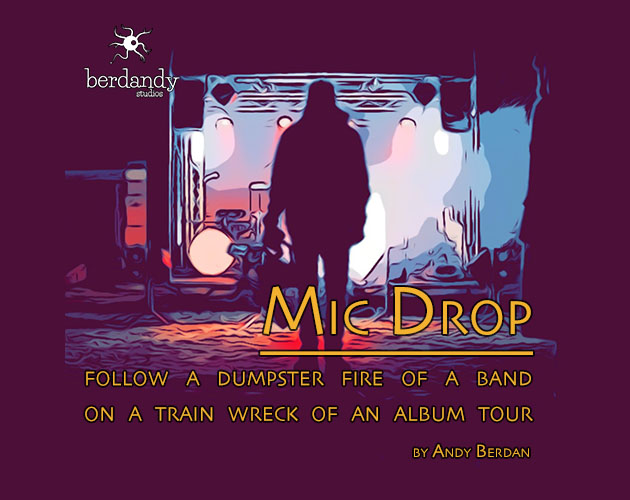

------

*Mic Drop* is played as a tabletop story game, around a table (or in the green room). Each player is a member of the band or the entourage, and all share in the telling of the story. Or the descent into chaos, such as it is.

## Mic Drop is now in Early Access!

Check out [@micdropgame on itch.io](https://berdandy.itch.io/mic-drop) for a plaintext copy of the game (as played at Metatopia), and a free upgrade to the pretty version when it's released.

---

## Personae

* *The Backbone*: Part peacekeeper, part judge, part parent, as The Backbone, you keep the band on task and working as a cohesive unit. You're the voice of reason and structure.
* *The Writer*: You write 90% of the songs. Occasionally, somebody will contribute bits and pieces, but almost all of the glory (and blame) is on *your* overloaded shoulders. But nobody else has the chops.
* *The Hothead*: You embody pure physicality. "Poor Impulse Control" could be on your business card. Your emotions are way closer to the surface than most, but it makes for some damn tasty tunes.
* *and more...*

---

## *Mic Drop* is in heavy (metal?) production. For more info

- Ping Andy Berdan on [twitter](http://twitter.com/andyberdan) or [email](mailto:andy@berdan.ca). He loves interacting with awesome people.
- Check out [GMParty](http://gmparty.com). A game design talk show hosted by Andy. Mic Drop has featured on the show before, and likely will show up again.
